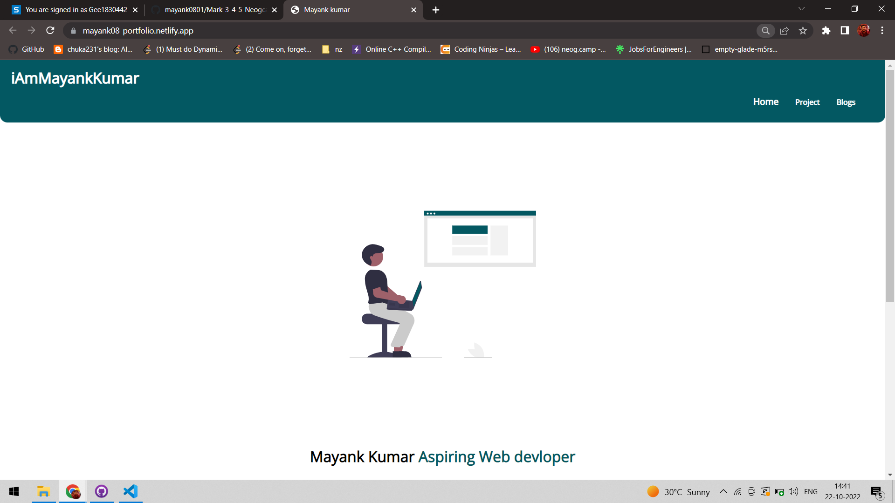

# Mark 4 and 5: Making portfolio
## About:
- A home page with introduction, and Projects with Source Code and Live link.
- I've put all my projects and social media handles majorly Twitter, and LinkedIn in the portfolio.
- Used Netlify to Host the Portfolio and other Project.Link to the same is attached with this repo.
- Added a Blogs section where i've listed all my blogs.
- Link to the portfolio is [here](https://mayank08-portfolio.netlify.app/)

## Tech stack used:
- HTML
- CSS

